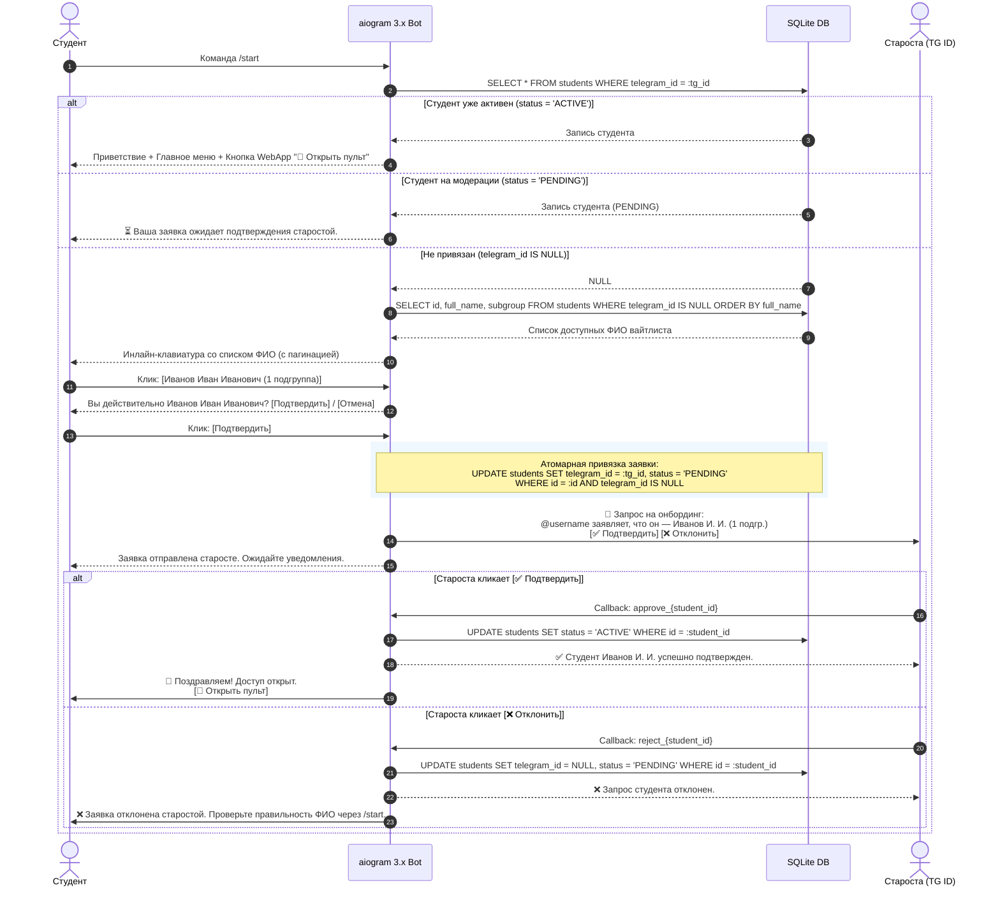
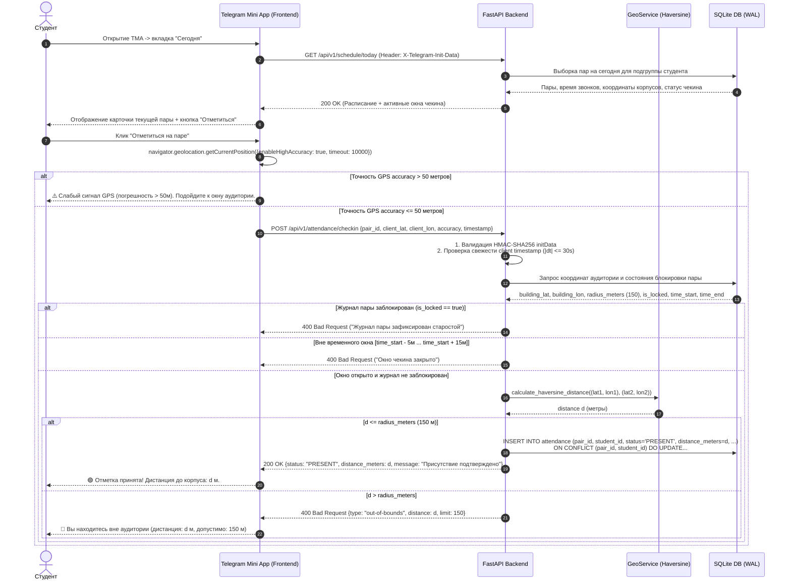
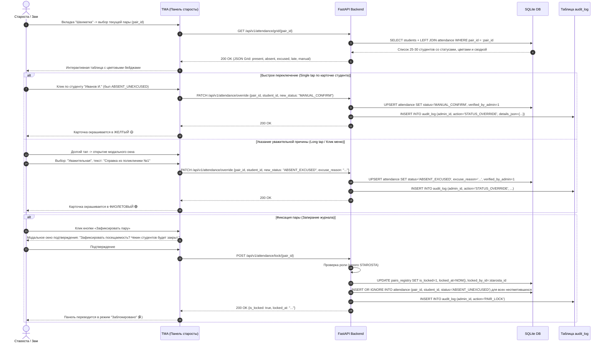
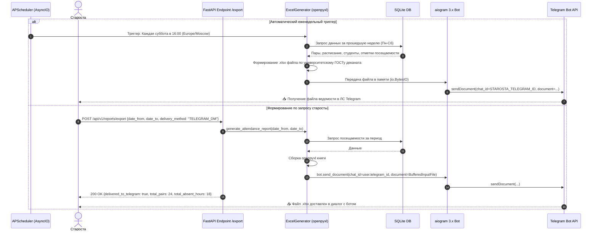

# Архитектурный анализ и исследование системных рабочих процессов (Architecture & Workflows Survey Report)

**Проект:** АРМ Старосты («Пульт управления группой 240326»)  
**Академическая группа:** 240326 «Математика и Информатика» (Матинф), БГПУ им. М. Акмуллы  
**Исследователь:** `explorer_survey_3`  
**Дата:** 2026-09-08  
**Статус:** Выполнено (Архитектурный анализ)

---

## Резюме

В данном отчете представлен глубокий системный анализ архитектуры, сквозных пользовательских сценариев (End-to-End Workflows), межмодульных контрактов, механизмов многопоточности, работы SQLite в режиме WAL, жизненного цикла асинхронных сессий SQLAlchemy 2.0, а также разработана исчерпывающая стратегия тестирования с генератором моков криптографической подписи Telegram `initData`.

---

## 1. Сквозные пользовательские сценарии (End-to-End User Workflows)

### 1.1. Сценарий онбординга студентов (Student Onboarding Flow)



#### Детали реализации и граничные случаи:
1. **Пагинация вайтлиста:** Группа 240326 насчитывает 25–30 человек. В одном сообщении Telegram оптимально отображать 6–8 фамилий на страницу с навигационными инлайн-кнопками `[⬅️ Назад]` `[Стр. X/Y]` `[Вперед ➡️]`.
2. **Атомарность выбора ФИО (защита от гонки двух пользователей):**
   ```sql
   UPDATE students 
   SET telegram_id = :user_tg_id, status = 'PENDING', updated_at = CURRENT_TIMESTAMP
   WHERE id = :selected_student_id AND telegram_id IS NULL;
   ```
   Если `rowcount == 0`, значит другой пользователь уже выбрал эту фамилию долю секунды назад. Бот возвращает сообщение: *«Данное ФИО уже занято или отправлено на модерацию»*.
3. **Управление ролями при инициализации:** Запись старосты в таблице `students` инициализируется скриптом сидирования с ролью `STAROSTA`, статусом `ACTIVE` и жестко привязанным `STAROSTA_TELEGRAM_ID` из `.env`.

---

### 1.2. Сценарий геочекина на учебной паре (Geocheckin Flow)



#### Математический расчет расстояния (Haversine Formula):
$$a = \sin^2\left(\frac{\Delta \varphi}{2}\right) + \cos(\varphi_1) \cdot \cos(\varphi_2) \cdot \sin^2\left(\frac{\Delta \lambda}{2}\right)$$
$$c = 2 \cdot \operatorname{atan2}\left(\sqrt{a}, \sqrt{1-a}\right)$$
$$d = R \cdot c, \quad \text{где } R = 6\,371\,000 \text{ метров}$$

#### Критерии допуска к отметке:
- **Радиус валидации:** $d \le 150.0$ м (учитывает габариты учебных корпусов БГПУ и погрешность городских переотражений).
- **Погрешность устройства:** `accuracy` $\le 50.0$ м.
- **Временное окно:** $T_{\text{start}} - 5\text{ мин} \le T_{\text{server}} \le T_{\text{start}} + 15\text{ мин}$.
- **Защита от спуфинга и реплея:** Разница между серверным временем и клиентским `timestamp` не превышает 30 секунд.

---

### 1.3. Сценарий интерактивной шахматки старосты (Starosta Chessboard Flow)



#### Цветовая схема шахматки:
| Статус | Код | Цвет UI | Описание |
|---|---|---|---|
| `PRESENT` | · | Зеленый 🟢 | Успешный геочекин студента через GPS |
| `ABSENT_UNEXCUSED` | **Н** | Серый/Красный 🔴 | Пропуск без уважительной причины (по умолчанию) |
| `MANUAL_CONFIRM` | · | Желтый 🟡 | Ручное подтверждение старостой (сел телефон, сбой GPS) |
| `LATE` | **О** | Синий 🔵 | Опоздание студента на занятие |
| `ABSENT_EXCUSED` | **У** | Фиолетовый 🟣 | Уважительная причина (справка, приказ, заявление) |

---

### 1.4. Сценарий автоматической и заказной генерации ведомости Excel (Excel Report Generation)



#### Стандарт рапортички деканата БГПУ (openpyxl):
1. **Шапка документа:**
   - Строка 1: «Башкирский государственный педагогический университет им. М. Акмуллы»
   - Строка 2: «Институт физики, математики, цифровых и нанотехнологий» (ФМНО)
   - Строка 3: «ВЕДОМОСТЬ УЧЕТА ПОСЕЩАЕМОСТИ ЗАНЯТИЙ СТУДЕНТАМИ»
   - Строка 4: «Группа: 240326 Матинф | Период: с {date_from} по {date_to} | Неделя: {week_number} ({week_type})»
2. **Табличная часть:**
   - Колонка A: № п/п (1 .. N)
   - Колонка B: Фамилия, Имя, Отчество студента (строго по алфавиту)
   - Колонки C .. AB: Дни недели с Понедельника по Субботу, под каждым днем колонки пар 1 .. 6.
   - Обозначения ячеек: пусто (был), `Н` (неуваж.), `У` (уваж.), `О` (опоздание).
3. **Итоговый блок формул Excel:**
   - Пропущено по неуважительной причине (часов): `=COUNTIF(C{row}:AB{row}, "Н") * 2`
   - Пропущено по уважительной причине (часов): `=COUNTIF(C{row}:AB{row}, "У") * 2`
   - Всего пропущено (часов): `={col_unexcused} + {col_excused}`
   - Итоговая строка группы снизу: `=SUM(AC7:AC{last_row})`
4. **Стилистическое оформление:**
   - Границы ячеек (`Border(thin)`).
   - Заливка шапки серым тоном (`PatternFill(start_color="E0E0E0")`).
   - Автоподбор ширины колонок по содержимому.

---

## 2. Межмодульные интерфейсные контракты (Interface Contracts)

Система функционирует как единый асинхронный сервис под управлением ASGI-сервера Uvicorn. Ниже представлена диаграмма связей модулей и протоколов взаимодействия:

```
┌─────────────────────────────────────────────────────────────────────────────┐
│                             Telegram Client                                 │
│          ┌───────────────────────┐   ┌────────────────────────┐             │
│          │  Telegram Bot Chat    │   │ Telegram Mini App (UI) │             │
│          └───────────┬───────────┘   └───────────┬────────────┘             │
└──────────────────────┼───────────────────────────┼──────────────────────────┘
                       │ LongPolling / Webhook     │ HTTPS REST + X-InitData
                       ▼                           ▼
┌─────────────────────────────────────────────────────────────────────────────┐
│                            Uvicorn Process                                  │
│                                                                             │
│  ┌─────────────────────────┐             ┌───────────────────────────────┐  │
│  │   aiogram 3.x Engine    │◄───────────►│       FastAPI Backend         │  │
│  │   - Bot / Dispatcher    │ Direct Call │       - Routers (/api/v1)     │  │
│  │   - Handlers & Dialogs  │ (Internal)  │       - Pydantic v2 Schemas   │  │
│  │   - Broadcaster         │             │       - Security (HMAC-SHA256)│  │
│  └───────────┬─────────────┘             └───────────────┬───────────────┘  │
│              │                                           │                  │
│              │        ┌────────────────────────┐         │                  │
│              └───────►│  SQLAlchemy 2.0 Async  │◄────────┘                  │
│                       │  Session / Engine      │                            │
│                       └───────────┬────────────┘                            │
│                                   │                                         │
│                                   ▼                                         │
│                       ┌────────────────────────┐                            │
│                       │   SQLite (WAL mode)    │                            │
│                       │   database.sqlite      │                            │
│                       └────────────────────────┘                            │
│                                   ▲                                         │
│                                   │ Read-only query                         │
│  ┌─────────────────────────┐      │      ┌───────────────────────────────┐  │
│  │  APScheduler (AsyncIO)  ├──────┴─────►│ Excel Generator (openpyxl)    │  │
│  │  - Cron weekly Saturday │             │ - Report builder              │  │
│  └─────────────────────────┘             └───────────────────────────────┘  │
└─────────────────────────────────────────────────────────────────────────────┘
```

### 2.1. Контракт: WebApp (TMA) $\longleftrightarrow$ FastAPI
- **Транспорт:** HTTPS / JSON.
- **Обязательный заголовок аутентификации:** `X-Telegram-Init-Data`.
- **Формат ошибок:** RFC 7807 (Problem Details for HTTP APIs).
- **Схема авторизации (HMAC-SHA256):**
  - Клиент передает строку параметров `window.Telegram.WebApp.initData`.
  - Сервер на Python вычисляет `secret_key = HMAC_SHA256(b"WebAppData", bot_token.encode())`.
  - Сортирует параметры (исключая `hash`), собирает строку проверки через `\n`.
  - Вычисляет `HMAC_SHA256(secret_key, data_check_string).hexdigest()`.
  - Сравнивает через `hmac.compare_digest(...)`.
  - Проверяет `auth_date` ($\Delta t \le 86400$ с).

### 2.2. Контракт: FastAPI $\longleftrightarrow$ SQLAlchemy 2.0 Async $\longleftrightarrow$ SQLite WAL
- **Пул соединений:** `create_async_engine("sqlite+aiosqlite:///data/database.sqlite")`.
- **Жизненный цикл сессии:** `async_sessionmaker(expire_on_commit=False)`.
- **FastAPI Dependency Injection:**
  ```python
  async def get_db_session() -> AsyncGenerator[AsyncSession, None]:
      async with async_session_factory() as session:
          try:
              yield session
              await session.commit()
          except Exception:
              await session.rollback()
              raise
  ```

### 2.3. Контракт: FastAPI / APScheduler $\longleftrightarrow$ aiogram 3.x Bot
- **Прямой вызов:** Экземпляр `Bot(token=settings.BOT_TOKEN)` регистрируется в контексте приложения FastAPI (`app.state.bot`).
- **Служба рассылки алертов (`Broadcaster`):**
  - При вызове `POST /api/v1/alerts/broadcast` эндпоинт отправляет сообщения в фоновом режиме через `asyncio.create_task`.
  - Отправка в групповой чат `settings.GROUP_CHAT_ID` с тегом `@all`.
  - Адресная рассылка по списку `telegram_id` активных студентов с паузой 0.05 с между запросами для соблюдения лимитов Telegram API (30 сообщений в секунду).
- **Служба доставки отчетов:**
  - Генератор отчетов создает объект `io.BytesIO`.
  - Бот отправляет файл через `bot.send_document(chat_id=..., document=BufferedInputFile(file_bytes, filename="..."))`.

---

## 3. Анализ конкурентности, состояния и SQLite WAL (Concurrency & State Management)

### 3.1. Особенности работы SQLite в многопользовательской среде
По умолчанию классический SQLite использует режим `rollback journal`, при котором любая операция записи (`INSERT`/`UPDATE`) блокирует базу целиком на чтение и запись (`EXCLUSIVE LOCK`).

Для обеспечения работы АРМ Старосты (30 одновременных чекинов за 5 секунд) активируется режим **Write-Ahead Logging (WAL)**:

```sql
-- 1. Режим WAL: Читатели не блокируют писателей, писатель не блокирует читателей
PRAGMA journal_mode = WAL;

-- 2. Безопасная синхронизация без лишних fsync при WAL
PRAGMA synchronous = NORMAL;

-- 3. Принудительный контроль ссылочной целостности
PRAGMA foreign_keys = ON;

-- 4. Таймаут ожидания освобождения блокировки при записи (5 секунд)
PRAGMA busy_timeout = 5000;

-- 5. Выделение 64 МБ оперативной памяти под страничный кэш
PRAGMA cache_size = -64000;
```

#### Настройка в SQLAlchemy 2.0 AsyncEngine:
В драйвере `aiosqlite` прагмы должны применяться к каждому новому физическому соединению:
```python
from sqlalchemy import event
from sqlalchemy.ext.asyncio import create_async_engine

engine = create_async_engine(
    settings.DATABASE_URL,
    echo=False,
    connect_args={"check_same_thread": False},
)

@event.listens_for(engine.sync_engine, "connect")
def configure_sqlite_pragmas(dbapi_connection, connection_record):
    cursor = dbapi_connection.cursor()
    cursor.execute("PRAGMA journal_mode = WAL;")
    cursor.execute("PRAGMA synchronous = NORMAL;")
    cursor.execute("PRAGMA foreign_keys = ON;")
    cursor.execute("PRAGMA busy_timeout = 5000;")
    cursor.execute("PRAGMA cache_size = -64000;")
    cursor.close()
```

### 3.2. Анализ потенциальных состояний гонки (Race Conditions) и методы защиты

| № | Потенциальное состояние гонки | Последствия | Архитектурное решение и защита |
|---|---|---|---|
| 1 | **Thundering Herd на чекине:** 30 студентов жмут «Отметиться» ровно в 08:30:01 | Конкурентные записи в `attendance`, риск ошибки `database is locked` | 1. `PRAGMA busy_timeout = 5000` выстраивает писателей в очередь (транзакция записи длится < 1 мс).<br/>2. Уникальный индекс `UNIQUE(pair_id, student_id)` защищает от дублей.<br/>3. Идемпотентный `UPSERT`. |
| 2 | **Повторный клик студента:** Двойной тап по кнопке чекина в Mini App | Создание дублирующих записей о посещении | Уникальный составной ключ `CONSTRAINT uq_pair_student UNIQUE (pair_id, student_id)` на уровне схемы БД. |
| 3 | **Чекин в момент запирания пары:** Студент шлет GPS ровно в момент, когда староста нажимает «Зафиксировать пару» | Отметка студента после официального закрытия журнала | В транзакции чекина статус `is_locked` проверяется в том же запросе выборки пары. Если `is_locked == True`, транзакция чекина отклоняется со статусом 400. |
| 4 | **Конкуренция ручного оверрайда и GPS:** Староста ставит `MANUAL_CONFIRM`, а через секунду прилетает запоздалый GPS-чекин | Затирание ручного решения старосты автоматическим геочекином | Правило приоритета: если `attendance.verified_by_admin == True`, автоматический GPS-чекин игнорируется или не перезаписывает статус. |
| 5 | **Гонка выбора фамилии при онбординге:** Два однофамильца или шутника выбирают одну запись из вайтлиста | Два Telegram-аккаунта связываются с одним студентом | Атомарный SQL-запрос `UPDATE students SET telegram_id = :tg_id WHERE id = :id AND telegram_id IS NULL;`. Если `rowcount == 0`, второй запрос отклоняется. |
| 6 | **Блокировка базы сетевыми вызовами Telegram API:** Вызов `await bot.send_message()` внутри открытой транзакции БД | Долгая блокировка таблицы на время ответа серверов Telegram (до 2–5 секунд) | **Строжайшее архитектурное правило:** Транзакция БД должна быть закрыта (`commit()`) ДО любых сетевых вызовов в Telegram Bot API. |

---

## 4. Стратегия тестирования и рекомендации (Testing Strategy)

Для обеспечения надежности системы рекомендуется трехуровневая стратегия тестирования:
1. **Unit-тесты:** Изолированная проверка алгоритмов (Haversine, HMAC initData, валидаторы временных окон).
2. **Интеграционные API-тесты:** Запуск FastAPI через `httpx.AsyncClient` с реальной базой SQLite (в памяти или временном каталоге).
3. **E2E и Concurrency стресс-тесты:** Имитация одновременного геочекина 30 студентов и сценария онбординга.

### 4.1. Генератор тестовых моков Telegram `initData`
Для независимого автоматического тестирования без реального Telegram разработан генератор валидных и невалидных криптографических подписей:

```python
import hmac
import hashlib
import json
import time
from urllib.parse import urlencode

def generate_mock_telegram_init_data(
    bot_token: str,
    user_id: int = 123456789,
    first_name: str = "Иван",
    last_name: str = "Иванов",
    username: str = "ivanov",
    auth_date: int | None = None,
    tampered: bool = False
) -> str:
    """
    Генерирует криптографически корректную строку X-Telegram-Init-Data.
    """
    if auth_date is None:
        auth_date = int(time.time())

    user_dict = {
        "id": user_id,
        "first_name": first_name,
        "last_name": last_name,
        "username": username,
        "language_code": "ru"
    }

    params = {
        "auth_date": str(auth_date),
        "query_id": "AAHd...mock_query_id",
        "user": json.dumps(user_dict, separators=(',', ':'))
    }

    # Сортировка параметров по ключу
    data_check_string = "\n".join(f"{k}={params[k]}" for k in sorted(params.keys()))

    # Вычисление secret_key
    secret_key = hmac.new(b"WebAppData", bot_token.encode("utf-8"), hashlib.sha256).digest()

    # Контрольный хэш
    data_hash = hmac.new(secret_key, data_check_string.encode("utf-8"), hashlib.sha256).hexdigest()

    if tampered:
        data_hash = "deadbeef" + data_hash[8:]

    params["hash"] = data_hash
    return urlencode(params)
```

### 4.2. Архитектура тестового стенда (Fixtures & Harness)

Рекомендуемая структура тестового пакета `tests/`:
```
tests/
├── conftest.py               # Фикстуры: test_db, test_client, mock_bot, auth_headers
├── test_unit/
│   ├── test_geo.py           # Тесты математики гаверсинусов и граничных радиусов
│   ├── test_security.py      # Тесты HMAC валидатора initData и срока давности
│   └── test_excel.py         # Тесты структуры книги openpyxl и формул
├── test_integration/
│   ├── test_auth_api.py      # Эндпоинты аутентификации и профиля
│   ├── test_schedule_api.py  # Выдача расписания по подгруппам
│   ├── test_checkin_api.py   # Геочекин: внутри радиуса, снаружи, окно закрыто
│   ├── test_grid_api.py      # Шахматка: выборка, оверрайды, запирание пары
│   └── test_reports_api.py   # Экспорт ведомости
└── test_e2e/
    ├── test_onboarding_flow.py # Полный цикл регистрации от /start до аппрува
    └── test_concurrency.py     # Стресс-тест: 30 одновременных чекинов через asyncio.gather
```

#### Пример теста конкурентного чекина (`test_concurrency.py`):
```python
import asyncio
import pytest
from httpx import AsyncClient

@pytest.mark.asyncio
async def test_simultaneous_checkins(async_client: AsyncClient, seeded_pair_id: int, student_tokens: list[str]):
    """
    Эмуляция одновременного чекина 30 студентов группы в интервале 1 секунды.
    Проверяет отсутствие ошибок 'database is locked' и корректность записи в БД.
    """
    async def make_checkin(token: str):
        headers = {"X-Telegram-Init-Data": token}
        payload = {
            "pair_id": seeded_pair_id,
            "client_lat": 54.726100,
            "client_lon": 55.945300,
            "accuracy": 15.0,
            "timestamp": 1725801900
        }
        return await async_client.post("/api/v1/attendance/checkin", json=payload, headers=headers)

    # 30 одновременных асинхронных запросов
    responses = await asyncio.gather(*(make_checkin(tok) for tok in student_tokens))

    # Все запросы должны успешно завершиться со статусом 200 OK
    assert all(r.status_code == 200 for r in responses)
    assert len(responses) == len(student_tokens)
```

---

## 5. Выводы и рекомендации для этапа реализации

1. **Асинхронность и целостность транзакций:**
   - Не удерживать открытые транзакции базы данных при выполнении запросов к сторонним API (Telegram Bot API).
   - Применять `PRAGMA busy_timeout = 5000` и `PRAGMA journal_mode = WAL` на уровне событий `connect` движка SQLAlchemy.
2. **Безопасность геопозиционирования:**
   - Строго проверять `accuracy <= 50.0` м на бэкенде.
   - Вычислять расстояние по формуле гаверсинусов на сервере (никогда не доверять расстоянию, вычисленному на клиенте).
3. **Генерация отчетов:**
   - Модуль `openpyxl` является синхронной библиотекой, интенсивно нагружающей процессор при сборке таблиц со стилями. Вызовы генератора ведомостей рекомендуется оборачивать в `asyncio.to_thread(excel_generator.build, ...)` для предотвращения блокировки основного Event Loop FastAPI.
4. **Сквозное тестирование:**
   - Подготовить модульные фикстуры со списком группы 240326 и эталонными координатами корпусов БГПУ, чтобы каждый разработчик мог локально запускать `pytest` без реального Telegram-бота.
