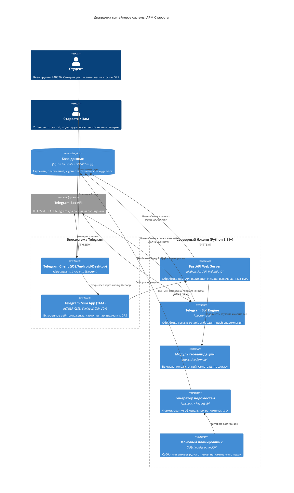
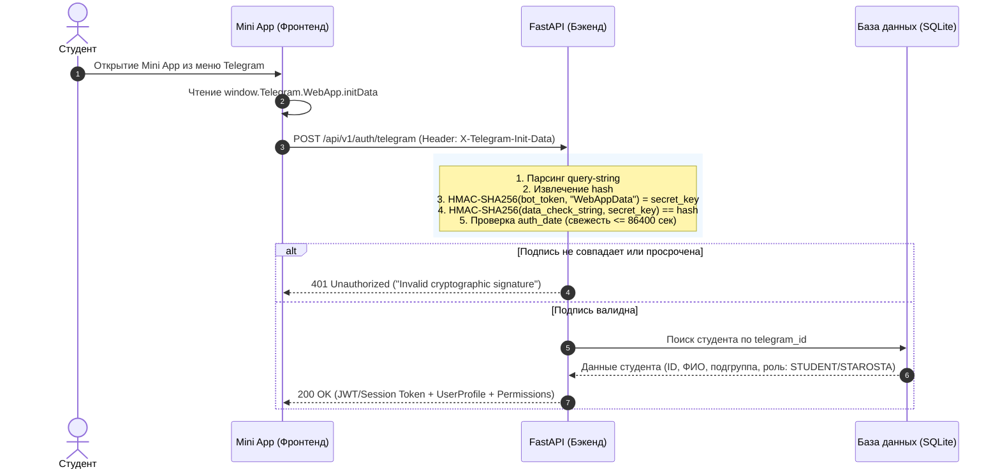
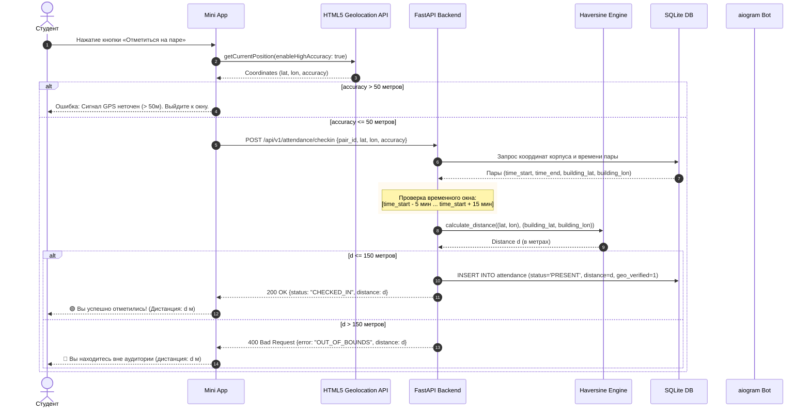
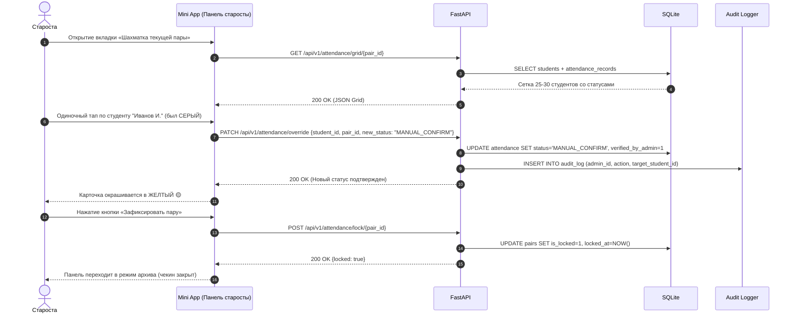

# АРХИТЕКТУРА И СИСТЕМНЫЙ ДИЗАЙН (ARCHITECTURE)

## Проект: АРМ Старосты («Пульт управления группой 240326»)
**Версия:** 1.0.0  
**Технологический стек:** Python 3.11+, FastAPI, aiogram 3.x, SQLAlchemy 2.0 (asyncio), SQLite, openpyxl, APScheduler, Telegram WebApp SDK.

---

## 1. Концептуальная архитектура (C4 Container)

Система построена по модели асинхронного модульного монолита, где Telegram-бот и REST API работают в едином процессе под управлением ASGI-сервера Uvicorn.



---

## 2. Диаграммы последовательности ключевых процессов

### 2.1. Аутентификация и валидация Telegram `initData` (HMAC-SHA256)
Вся авторизация в Mini App происходит без передачи логинов и паролей на базе криптографической подписи Telegram:



### 2.2. Процесс геочекина на занятии


### 2.3. Интерактивная шахматка старосты и оверрайды


---

## 3. Архитектура безопасности

### 3.1. Алгоритм валидации `initData` на Python
```python
import hmac
import hashlib
from urllib.parse import parse_qsl

def validate_telegram_init_data(init_data: str, bot_token: str) -> dict | None:
    """
    Валидация подлинности данных запуска WebApp по спецификации Telegram.
    1. Парсим строку вида key=value&hash=...
    2. Извлекаем переданный hash
    3. Формируем data_check_string из остальных параметров по алфавиту
    4. Вычисляем secret_key = HMAC_SHA256("WebAppData", bot_token)
    5. Вычисляем hmac = HMAC_SHA256(secret_key, data_check_string).hexdigest()
    6. Сравниваем hmac с hash
    """
    parsed = dict(parse_qsl(init_data, keep_blank_values=True))
    received_hash = parsed.pop("hash", None)
    if not received_hash:
        return None

    # Сортировка параметров по ключам
    data_check_string = "\n".join(f"{k}={v}" for k, v in sorted(parsed.items()))
    
    # Генерация секретного ключа
    secret_key = hmac.new(b"WebAppData", bot_token.encode(), hashlib.sha256).digest()
    
    # Вычисление контрольного хэша
    calculated_hash = hmac.new(secret_key, data_check_string.encode(), hashlib.sha256).hexdigest()
    
    if hmac.compare_digest(calculated_hash, received_hash):
        return parsed
    return None
```

### 3.2. Ролевой Middleware и Dependency Injection
В FastAPI эндпоинты защищены цепочкой зависимостей:
```python
async def get_current_user(x_telegram_init_data: str = Header(...)) -> User:
    user_data = validate_telegram_init_data(x_telegram_init_data, settings.BOT_TOKEN)
    if not user_data:
        raise HTTPException(status_code=401, detail="Invalid Telegram InitData")
    # Проверка в БД и возврат User
    ...

def require_roles(*allowed_roles: RoleEnum):
    async def role_checker(user: User = Depends(get_current_user)):
        if user.role not in allowed_roles:
            raise HTTPException(status_code=403, detail="Forbidden: Insufficient permissions")
        return user
    return role_checker
```

---

## 4. Структура кодовой базы проекта

```
tg_bot/
├── bot/                       # Слой Telegram-бота (aiogram 3.x)
│   ├── handlers/             # Обработчики команд (/start, /help, /report)
│   ├── keyboards/            # Инлайн и реплай клавиатуры
│   ├── middlewares/          # Мидлвари (троттлинг, регистрация пользователей)
│   └── bot.py                # Инициализация Bot и Dispatcher
├── api/                       # Слой REST API (FastAPI)
│   ├── routes/               # Эндпоинты (auth, schedule, attendance, reports, alerts)
│   ├── schemas/              # Pydantic v2 схемы запросов/ответов
│   ├── dependencies.py       # Авторизация initData и RBAC guards
│   └── app.py                # Инициализация FastAPI приложения
├── core/                      # Ядро приложения
│   ├── config.py             # Настройки (pydantic-settings, .env)
│   ├── security.py           # HMAC валидация, криптография
│   └── database.py           # Подключение SQLAlchemy 2.0 AsyncEngine
├── models/                    # Декларативные ORM модели (SQLAlchemy)
│   ├── user.py               # Пользователи и студенты
│   ├── schedule.py           # Расписание и аудитории
│   ├── attendance.py         # Записи посещаемости
│   └── audit.py              # Журнал действий старосты
├── services/                  # Бизнес-логика
│   ├── geo_service.py        # Расчет расстояния (Haversine) и точности
│   ├── attendance_service.py # Чекин, шахматка, оверрайды
│   ├── excel_generator.py    # Сборка ведомости openpyxl
│   ├── broadcaster.py        # Рассылка экстренных алертов (@all, ЛС)
│   └── scheduler.py          # Планировщик фоновых задач APScheduler
├── webapp/                    # Фронтенд Telegram Mini App (SPA)
│   ├── index.html            # Каркас приложения
│   ├── css/                  # Стили (мобильная верстка, Telegram theme vars)
│   ├── js/                   # Логика: Geolocation, API client, шахматка
│   └── assets/               # Иконки и статика
├── docs/                      # Проектная документация (SRS, ARCHITECTURE, DB, API, DEPLOY)
├── tests/                     # Автоматические тесты (pytest, pytest-asyncio)
├── alembic/                   # Миграции базы данных
├── main.py                    # Главная точка входа (запуск FastAPI + aiogram webhook/polling)
├── requirements.txt           # Зависимости Python
├── Dockerfile                 # Докеризация сервиса
└── docker-compose.yml         # Оркестрация контейнеров
```
