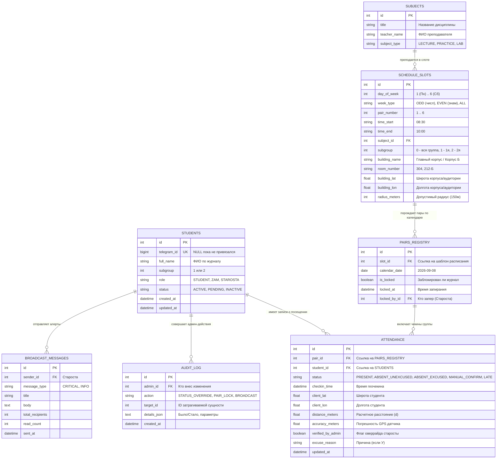

# МОДЕЛЬ ДАННЫХ И СПЕЦИФИКАЦИЯ БАЗЫ ДАННЫХ (DATABASE)

## Проект: АРМ Старосты («Пульт управления группой 240326»)
**СУБД:** SQLite (с поддержкой режима WAL и внешних ключей)  
**ORM:** SQLAlchemy 2.0 (Declarative Base, Mapped & mapped_column, AsyncEngine)  
**Инструмент миграций:** Alembic  

---

## 1. Диаграмма сущностей и связей (Entity-Relationship Diagram)



---

## 2. Подробная спецификация таблиц (DDL)

### 2.1. Таблица `students` (Студенты и учетные записи)
Хранит предзагруженный список группы и привязанные Telegram-профили.

```sql
CREATE TABLE students (
    id INTEGER PRIMARY KEY AUTOINCREMENT,
    telegram_id BIGINT UNIQUE NULL,
    full_name VARCHAR(150) NOT NULL,
    subgroup INTEGER NOT NULL CHECK (subgroup IN (1, 2)),
    role VARCHAR(20) NOT NULL DEFAULT 'STUDENT' CHECK (role IN ('STUDENT', 'ZAM', 'STAROSTA')),
    status VARCHAR(20) NOT NULL DEFAULT 'PENDING' CHECK (status IN ('PENDING', 'ACTIVE', 'BLOCKED')),
    created_at TIMESTAMP DEFAULT CURRENT_TIMESTAMP,
    updated_at TIMESTAMP DEFAULT CURRENT_TIMESTAMP
);

CREATE INDEX idx_students_telegram_id ON students(telegram_id);
CREATE INDEX idx_students_full_name ON students(full_name);
```

### 2.2. Таблица `subjects` (Учебные дисциплины)
```sql
CREATE TABLE subjects (
    id INTEGER PRIMARY KEY AUTOINCREMENT,
    title VARCHAR(150) NOT NULL,
    teacher_name VARCHAR(120),
    subject_type VARCHAR(20) NOT NULL CHECK (subject_type IN ('LECTURE', 'PRACTICE', 'LAB'))
);
```

### 2.3. Таблица `schedule_slots` (Базовая сетка расписания)
Шаблон регулярного расписания на семестр с геопривязкой аудиторий.

```sql
CREATE TABLE schedule_slots (
    id INTEGER PRIMARY KEY AUTOINCREMENT,
    day_of_week INTEGER NOT NULL CHECK (day_of_week BETWEEN 1 AND 6),
    week_type VARCHAR(10) NOT NULL DEFAULT 'ALL' CHECK (week_type IN ('ODD', 'EVEN', 'ALL')),
    pair_number INTEGER NOT NULL CHECK (pair_number BETWEEN 1 AND 6),
    time_start VARCHAR(5) NOT NULL, -- Формат "HH:MM", например "08:30"
    time_end VARCHAR(5) NOT NULL,   -- "10:00"
    subject_id INTEGER NOT NULL REFERENCES subjects(id) ON DELETE CASCADE,
    subgroup INTEGER NOT NULL DEFAULT 0 CHECK (subgroup IN (0, 1, 2)), -- 0 = вся группа
    building_name VARCHAR(100) NOT NULL,
    room_number VARCHAR(20) NOT NULL,
    building_lat REAL NOT NULL,
    building_lon REAL NOT NULL,
    radius_meters INTEGER NOT NULL DEFAULT 150
);

CREATE INDEX idx_schedule_lookup ON schedule_slots(day_of_week, week_type, subgroup);
```

### 2.4. Таблица `pairs_registry` (Фактический реестр пар)
Конкретное занятие в календаре учебного года. Создается динамически перед началом дня.

```sql
CREATE TABLE pairs_registry (
    id INTEGER PRIMARY KEY AUTOINCREMENT,
    slot_id INTEGER NOT NULL REFERENCES schedule_slots(id) ON DELETE RESTRICT,
    calendar_date DATE NOT NULL,
    is_locked BOOLEAN NOT NULL DEFAULT 0,
    locked_at TIMESTAMP NULL,
    locked_by_id INTEGER NULL REFERENCES students(id),
    CONSTRAINT uq_slot_date UNIQUE (slot_id, calendar_date)
);

CREATE INDEX idx_pairs_calendar_date ON pairs_registry(calendar_date);
```

### 2.5. Таблица `attendance` (Журнал посещаемости)
Записи геочекинов и ручных пометок старосты.

```sql
CREATE TABLE attendance (
    id INTEGER PRIMARY KEY AUTOINCREMENT,
    pair_id INTEGER NOT NULL REFERENCES pairs_registry(id) ON DELETE CASCADE,
    student_id INTEGER NOT NULL REFERENCES students(id) ON DELETE CASCADE,
    status VARCHAR(25) NOT NULL DEFAULT 'ABSENT_UNEXCUSED' 
        CHECK (status IN ('PRESENT', 'ABSENT_UNEXCUSED', 'ABSENT_EXCUSED', 'MANUAL_CONFIRM', 'LATE')),
    checkin_time TIMESTAMP NULL,
    client_lat REAL NULL,
    client_lon REAL NULL,
    distance_meters REAL NULL,
    accuracy_meters REAL NULL,
    verified_by_admin BOOLEAN NOT NULL DEFAULT 0,
    excuse_reason TEXT NULL,
    created_at TIMESTAMP DEFAULT CURRENT_TIMESTAMP,
    updated_at TIMESTAMP DEFAULT CURRENT_TIMESTAMP,
    CONSTRAINT uq_pair_student UNIQUE (pair_id, student_id)
);

CREATE INDEX idx_attendance_pair ON attendance(pair_id);
CREATE INDEX idx_attendance_student ON attendance(student_id);
```

### 2.6. Таблица `broadcast_messages` (История экстренных алертов)
```sql
CREATE TABLE broadcast_messages (
    id INTEGER PRIMARY KEY AUTOINCREMENT,
    sender_id INTEGER NOT NULL REFERENCES students(id),
    message_type VARCHAR(20) NOT NULL CHECK (message_type IN ('CRITICAL', 'INFO')),
    title VARCHAR(150) NOT NULL,
    body TEXT NOT NULL,
    total_recipients INTEGER NOT NULL DEFAULT 0,
    read_count INTEGER NOT NULL DEFAULT 0,
    sent_at TIMESTAMP DEFAULT CURRENT_TIMESTAMP
);
```

### 2.7. Таблица `audit_log` (Журнал действий старосты)
```sql
CREATE TABLE audit_log (
    id INTEGER PRIMARY KEY AUTOINCREMENT,
    admin_id INTEGER NOT NULL REFERENCES students(id),
    action VARCHAR(50) NOT NULL,
    target_id INTEGER NULL,
    details_json TEXT NULL,
    created_at TIMESTAMP DEFAULT CURRENT_TIMESTAMP
);
```

---

## 3. Оптимизация и эксплуатационные настройки SQLite

Для обеспечения высокой конкурентности (одновременный чекин 30 человек за несколько секунд) активируются следующие прагмы SQLite:

```sql
-- Включение режима Write-Ahead Logging (чтение не блокирует запись)
PRAGMA journal_mode = WAL;

-- Оптимизация синхронизации с диском
PRAGMA synchronous = NORMAL;

-- Включение обязательной проверки внешних ключей
PRAGMA foreign_keys = ON;

-- Увеличение времени ожидания снятия блокировки (5 секунд)
PRAGMA busy_timeout = 5000;

-- Кэширование страниц в памяти
PRAGMA cache_size = -64000; -- 64 МБ оперативной памяти
```

---

## 4. Стратегия резервного копирования (Backup)

Так как файл `database.sqlite` содержит официальные данные посещаемости, настраивается автоматическое резервное копирование без остановки сервера:

1. **Ежедневный снэпшот (в 23:59):**  
   Использование встроенной команды SQLite Online Backup:  
   `sqlite3 database.sqlite "VACUUM INTO 'backups/backup_$(date +\%Y\%m\%d).sqlite'"`
2. **Ротация:** Хранение последних 14 ежедневных и 8 еженедельных резервных копий.
3. **Зеркалирование:** Отправка бэкапа в закрытый канал Telegram для старосты.
